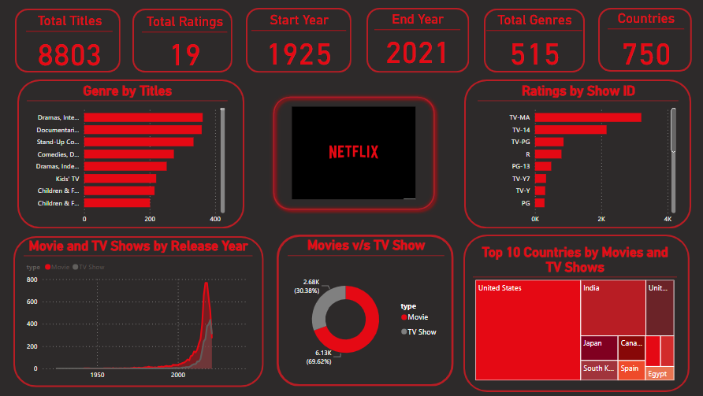

# Netflix_PowerBI_Dashboard 🎬
"Netflix Power BI Dashboard" delves deep into this ever-expanding universe of entertainment, providing valuable insights and illuminating patterns that can steer content strategies and viewer engagement. Delivering data Insights as well as providing data visualizations.

# Introduction
Netflix is the leading streaming service around the world, offering a massive library of movies, TV shows, and even some documentaries.  In this age of digital entertainment, understanding the intricate dynamics of Netflix's content offering is paramount. Our "Netflix Power BI Dashboard" delves deep into this ever-expanding universe of entertainment, providing valuable insights and illuminating patterns that can steer content strategies and viewer engagement.

# Project Objecives 🎯
This Power BI project is structured around several key tasks designed to unlock the secrets of Netflix's content ecosystem:

Identifying Genres by Titles
Identifying Ratings by Show ID
Identifying Movies and TV Shows by Release Years
Total Number of Movies and TV Shows
Identifying Top 10 Countries by Movies and TV Shows

# Dashboard

# Visualization Tools

- Tool Used 🛠️: Microsoft PowerBI
- Dataset Used: [Netflix Dataset](https://www.kaggle.com/datasets/shivamb/netflix-shows)

This Power BI project leverages a rich palette of visualizations, including bar charts, area charts, tree maps, and donut charts. These visuals are carefully crafted to make complex data easily accessible and visually engaging, enhancing the user experience.

# Conclusion

In a world where data-driven decisions are paramount, our Netflix Power BI Dashboard Project empowers content creators, marketers, and decision-makers in the entertainment industry to navigate the Netflix universe effectively. Explore the nuances of content genres, audience preferences, and international contributions while unveiling the hidden gems within Netflix's content repository. Welcome to the era of data-driven entertainment strategy, brought to life through the power of Power BI.

Feel free to reach out for any questions or suggestions about this project. I'm open to discussions and eager to assist.
[LinkedIn | Jericho De Guzman](https://www.linkedin.com/in/jericho-de-guzman/)
